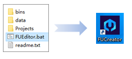
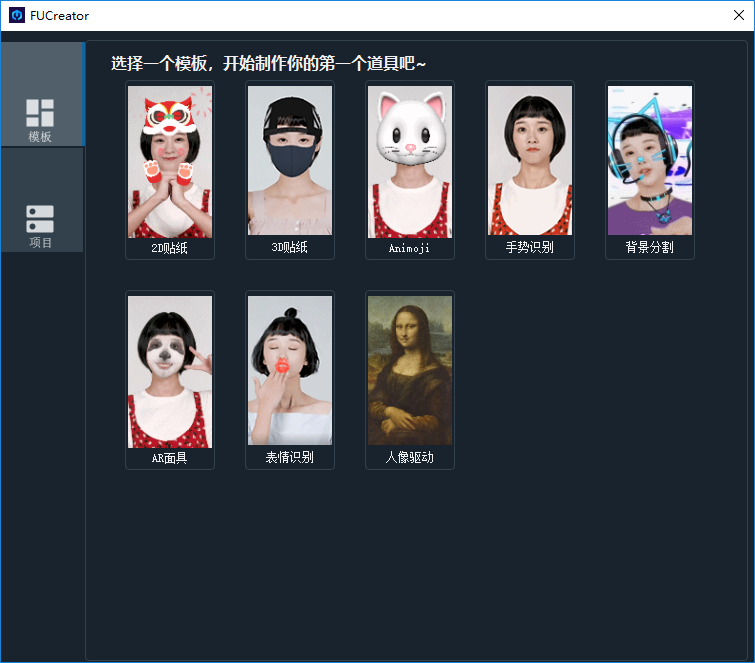
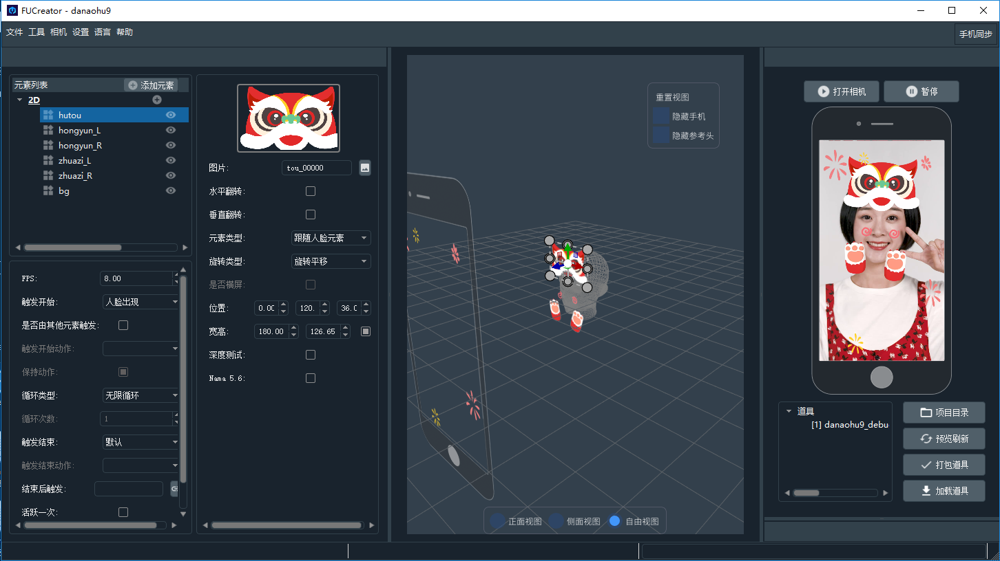

#  **FUCreator**

## 产品简介

欢迎来到FUCreator。

__FUCreator__ 是一款为NAMA SDK提供支持的道具编辑工具，不仅使用起来高效便捷且功能强大。

无论你是已接入NAMA SDK的企业中的设计师及开发人员，还是AR道具制作的爱好者，无论你想制作充满创意的3D动画特效，或者仅仅想做一个简单的面具，FUCreator都能在最大程度上为您的想法提供实践上的支持。

通过FUCreator，您可以轻松制作出2D道具，3D道具，Animoji，并支持通过特定的手势动作或表情来触发一些有趣的动画效果。

整个过程只需要简单3步：

1. 在Photoshop、3D Max、Maya等工具中进行设计，制作好素材，导入到FUCreator中。
2. 通过简单的元素编辑和交互触发设置，将您创作的素材生成为互动道具，整个过程可以实时预览。
3. 用您的专属证书进行打包，便可获得一个经过数字签名的线上道具，您可以分享给任何接入NAMA SDK的用户。

立即下载，开始制作您的专属特效道具吧！

## 快速入门

作为FUEditor的__全新升级版__，我们对FUEditor进行了全方位的优化，确保您在制作道具的过程中拥有更加舒适的体验，具体体现在以下几个方面：

-　软件启动

改用全新的安装包方式进行下载安装，提高工程的安全性。

采用桌面快捷方式启动软件，使整个启动过程更加的流畅便捷。

-　模板

我们提供了8款好用的模板工程，帮助您轻松创建第一个道具，打开新世界的大门。

我们的另存为机制维护了模板工程的安全性，不用担心模板工程会被您的好奇心变更掉。

-　新建项目优化

还记得被3D模板支配的恐惧吗？不用担心，在FUCreator中，您无需在新建项目的时候进行任何多余的选择，新建项目即新建一个完全空白的项目，您可以在进入主界面之后，再选择您需要的元素进行添加。

新项目在预览刷新的时候需要输入文件名，这时候您的项目会被自动保存下来，以便您随时进行再次编辑。

-　界面展示

深色系界面设计，让您更专注于自己的创作过程。

可拖动的界面模块，按照您喜欢的方式对界面进行排版，定制您的专属使用界面。

编辑视窗的网格设计，使整个窗口可以更加专业的为您提供可视化帮助，操作也更加的便捷高效。

-　实时预览

打开摄像头，您的每一步操作都会在预览窗口进行实时反馈，您可以直接预览到道具的最终效果，并进行及时的调整优化。

-　自动更新检查

我们的工具集成了自动更新检查的功能，您不用再担心会错过我们精彩的功能升级，我们会在您每次启动的时候对当前版本进行核查，若非最新版本，则会询问您是否需要升级。

我们也会在每天中午对您的工具进行版本检测，不论您是否经常使用我们的工具，我们都会维护您的工具拥有最新最全的功能。

除此之外，我们依然最大程度的保留了您曾经对于FUEditor的使用习惯，以及您熟悉的功能逻辑：

-　道具制作

我们依然支持制作2D道具，3D道具，Animoji，AR Mesh，触发试动画道具，手势识别道具，表情识别道具...

但是，我们还没有对滤镜道具进行整合，请期待之后的版本。

-　道具打包

所有的道具在正式打包之前依然是需要进行测试打包的，而这一次，我们省略掉反复的打包和刷新，只需要点击“预览刷新”，就可以一步进行测试打包和预览界面的刷新。

对于测试打包逻辑的保留可以从最大程度上保证您的正是道具效果是您真实预览过，认可过的。

-　目录逻辑

对于习惯之前FUEditor目录规则的用户来说，我们在FUCreator中保留了之前的目录逻辑，您的测试道具，图片资源，模型资源，正式道具，签名证书都在您熟悉的位置。

-　版本兼容

FUCreator是一款完全独立于FUEditor的工具软件，两者可以在同一台电脑上并存，您可以随时找回您在FUEditor中创建的珍贵道具。

FUCreator是基于Nama６.０的库，因此，使用FUCreator制作出来的道具可以在Nama　SDK　６.０上完美运行，而且与FUEditor６.０制作出来的道具完全一致。

## 软件截图

-软件启动

 

-模板

 

-主界面

  